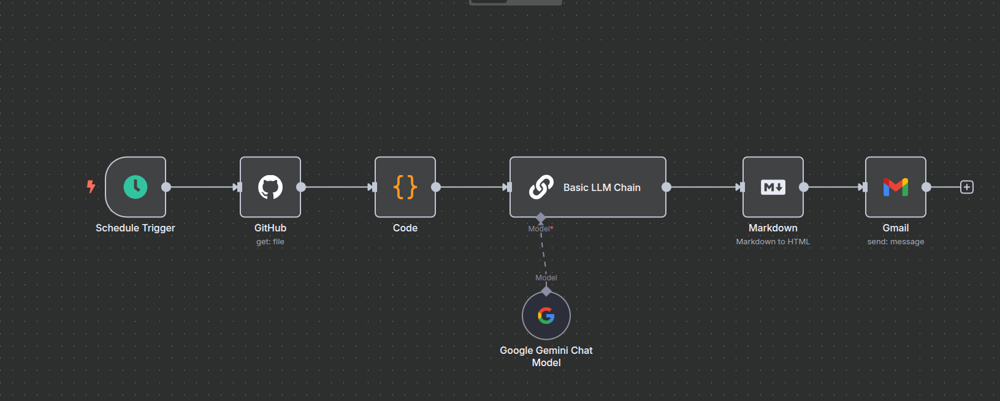

# Notícias IA

  

Este projeto coleta automaticamente as principais notícias sobre inteligência artificial publicadas nos últimos 7 dias e gera um feed RSS em `index.xml`.

## Como funciona

1. O script `generate_rss.py` busca as notícias em feeds RSS de fontes de inteligência artificial em português e inglês (atualmente AI News e Red Hat).
2. Apenas itens publicados nos últimos 7 dias são mantidos.
3. As descrições são extraídas do conteúdo completo do artigo (quando disponível) e resumidas para até 2300 caracteres.
4. O resultado é salvo no arquivo `index.xml` no formato RSS 2.0.

## Workflow N8N

Este projeto também inclui um workflow no [n8n](https://n8n.io/), uma plataforma de automação de código aberto, para processar o feed RSS gerado.

O workflow (`Simple_Newsletter.json`) atualmente lê o conteúdo do arquivo `index.xml` e pode ser configurado para realizar diversas ações, como:

* Enviar as notícias por e-mail.
* Postar um resumo nas redes sociais.
* Integrar com outras ferramentas e serviços.

Para utilizar este workflow:

1.  Instale o [n8n](https://n8n.io/docs/getting-started/).
2.  Importe o arquivo `Simple_Newsletter.json` para o seu ambiente n8n.
3.  Configure os nós do workflow (por exemplo, suas credenciais de e-mail, contas de redes sociais, etc.) de acordo com suas necessidades.
4.  Você pode configurar um trigger no n8n para executar este workflow automaticamente em um cronograma ou sempre que o `index.xml` for atualizado (isso pode exigir configurações adicionais dependendo de como o `index.xml` é atualizado e onde o n8n está rodando).

## Atualizações automáticas

Um fluxo de trabalho do GitHub Actions agendado executa o script `generate_rss.py` todos os sábados às 07h (UTC-3), equivalente a 10h UTC, e publica o arquivo atualizado `index.xml` no Cloudflare Pages.

Para acionar manualmente o workflow ou alterar configurações de deploy, edite `.github/workflows/main.yml`.